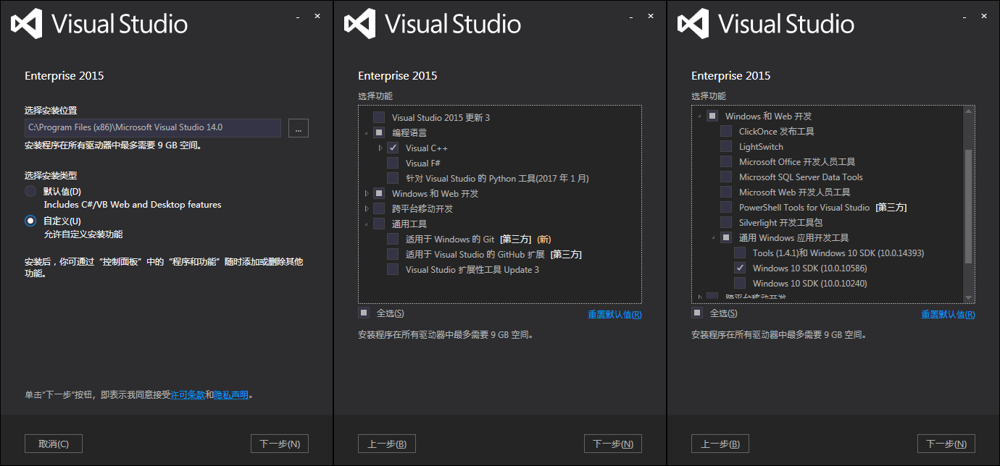
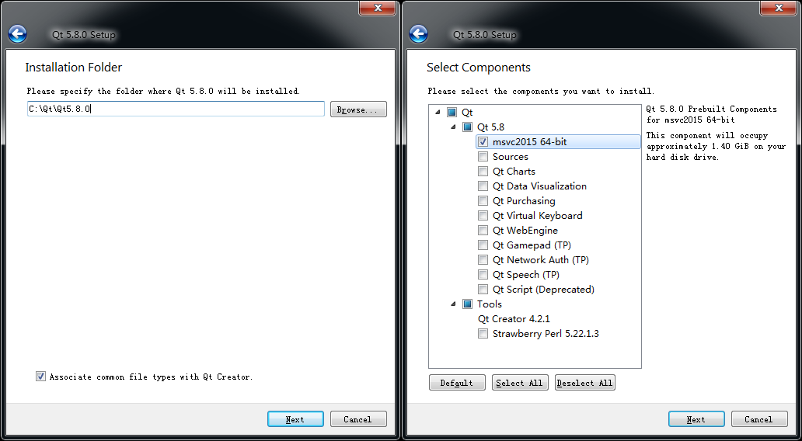
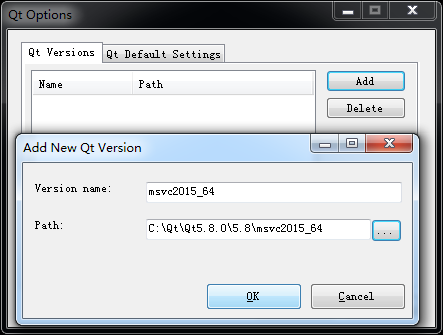
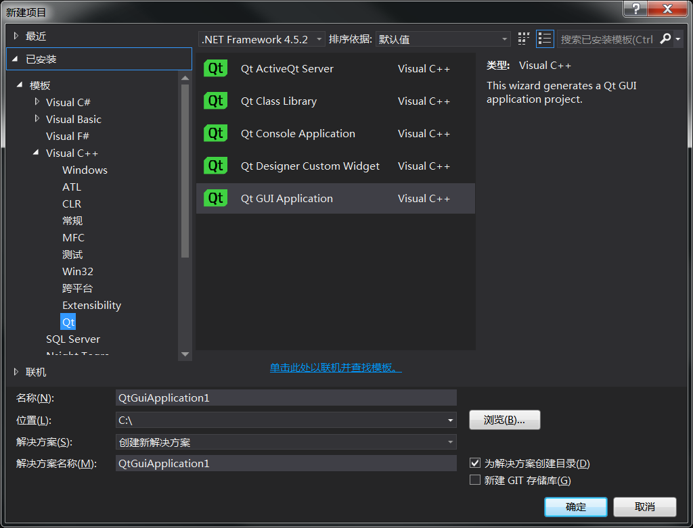
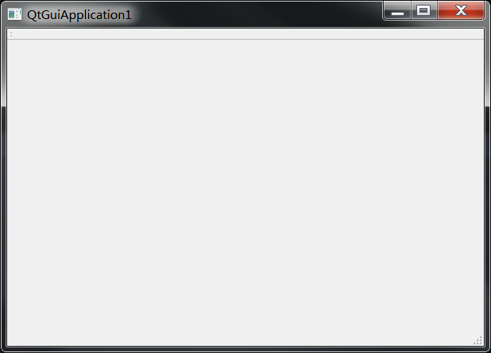
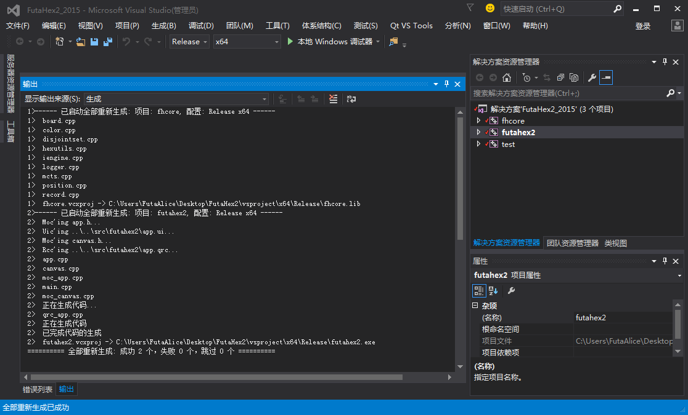

# Windows 环境下编译

核心代码使用了 C++11/14 新特性，**不支持** Visual Studio 2013 及以下版本的编译器。

## 配置要求

| ——       | 最低要求 |   建议配置   |
| :------- | :------: | :----------: |
| 操作系统 |   Win7   | Win7 / Win10 |
| 内存     |   8GB    |     16GB     |
| VS 版本  |  VS2015  |    VS2015    |
| Qt 库    |  Qt 5.x  |    Qt 5.8    |

注：程序编译链接期对计算机内存无要求，但运行期 MCTS 过程会展开大量节点，对于 11 * 11 或更大尺寸棋盘需要至少 3.5GB 以上的空闲内存。32位有内存限制，**建议使用64位编译**。

## 搭建开发环境

### 1）安装 Visual Studio

工程内大量使用了 C++11/14 特性，仅支持 VS2015 及以上版本。截至作者开始写 futahex2 的界面部分时， Qt 官方尚未提供用于 VS2017 的插件，故**建议安装 VS2015**。

如果仅编译核心库 fhcore 不需要图形界面，也可以选择 VS2017。

若使用其他 Visual Studio 版本，则需自行修改代码和工程配置，不保证能够正常编译。

安装选项参考：

### 2）安装 Qt

用于图形界面，讲道理 Qt5.x 都是可以的。

注意要安装 **msvc_64** 版本。mingw版本不能在 VS 工程中使用，32位 Qt不能链接64位库，运行时有 3GB 内存限制。

笔者用的 5.8，那就推荐 Qt5.8 算了。国内访问 Qt 官网比较慢，挂个度盘链接方便下载。

*qt_msvc2015_5.8.0.exe*

官网地址：[download.qt.io/archive/qt/](https://download.qt.io/archive/qt/5.8/5.8.0/qt-opensource-windows-x86-msvc2015_64-5.8.0.exe)

百度网盘：[pan.baidu.com/s/1w3j_mQtiisorqTPaSYNKxQ](https://pan.baidu.com/s/1w3j_mQtiisorqTPaSYNKxQ)

安装选项参考：

### 3）安装 Qt VS tools

用于在 VS 工程中使用 Qt库，在安装完成 VS 和 Qt 之后安装。

*qt_vs_tools_msvc2015_2.1.1.vsix*

官网地址：[download.qt.io/archive/vsaddin/](https://download.qt.io/archive/vsaddin/qt-vs-tools-msvc2015-2.1.1.vsix)

百度网盘：[pan.baidu.com/s/1WbTk2xrnoKesNMZgzarJrg](https://pan.baidu.com/s/1WbTk2xrnoKesNMZgzarJrg)

### 4）配置 Qt 路径

全部安装完成后打开 Visual Studio ，会发现菜单栏上多了一项“Qt VS Tools”。

从菜单栏 Qt VS Tools -> Qt Options，打开 Qt 配置，此时 Qt Versions 列表应该是空白的。

点击 Add 按钮添加安装完成的 Qt 版本，点击 path 选择 Qt(msvc2015_64) 所在路径并添加。

### 5）测试开发环境

顺序完成上述步骤后，打开 VS 新建一个 QtGuiApplication ，一路默认选项。

不改任何文件直接编译运行，正常弹出如下图所示的空白 Qt 窗口说明开发环境配置成功。

## 编译 FutaHex2

### 1）下载源码

github 地址：[github.com/FutaAlice/FutaHex2](https://github.com/FutaAlice/FutaHex2)

从 github 下载代码并拷贝至工作目录。
工作路径**全英文无空格**确保 Qt 插件能够正常工作。

### 2）编译运行

使用 VS2015 打开 “FutaHex2/vsproject/FutaHex2_2015.sln”，设置 futahex2 为启动项，选择 Release 模式，
编译运行即可。

