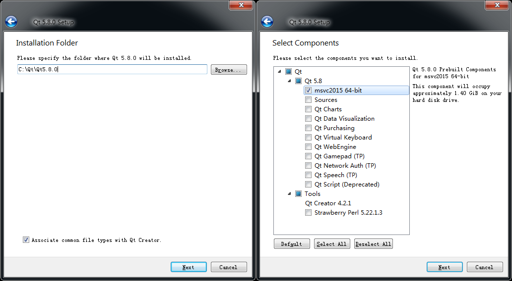
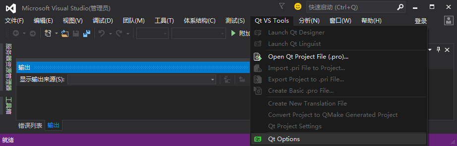
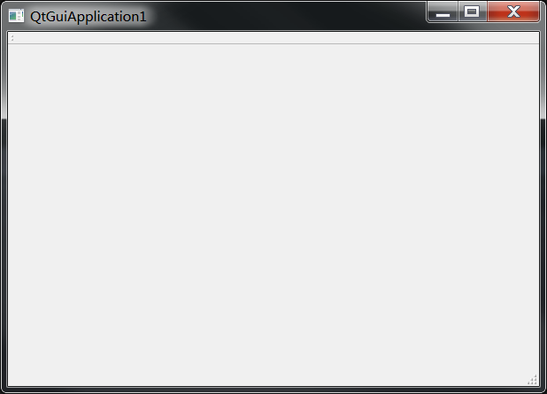
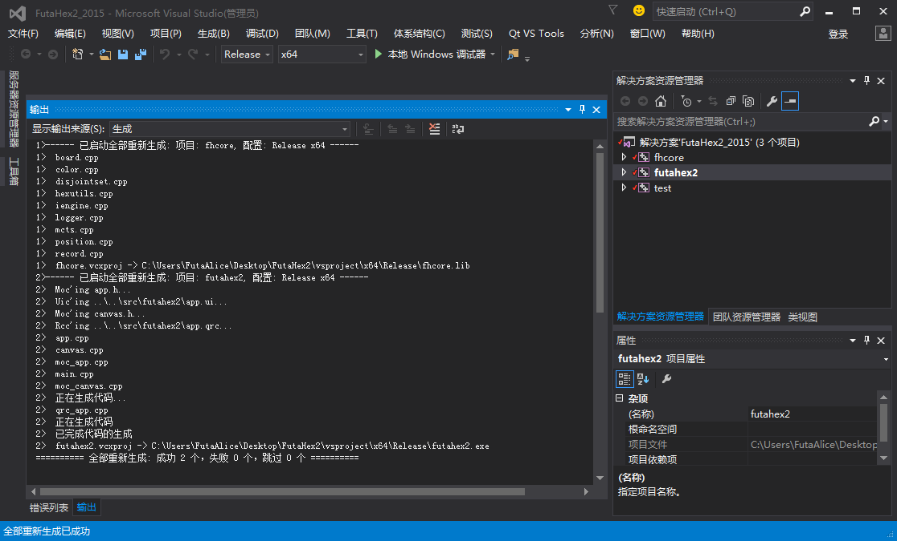

# 海克斯棋开源程序 FutaHex2 编译教程

FutaHex2 源码下载地址：[github.com/FutaAlice/FutaHex2](https://github.com/FutaAlice/FutaHex2)

**Hex棋** 也称六贯棋或海克斯棋，规则介绍参考 wiki（[中文](https://zh.wikipedia.org/wiki/%E5%85%AD%E8%B2%AB%E6%A3%8B) / [英文](https://en.wikipedia.org/wiki/Hex_(board_game))）。

## FutaHex2 简介

FutaHex2 是一个基于蒙特卡洛树搜索海克斯棋博弈程序。作者本人是 [全国大学生计算机博弈大赛](http://computergames.caai.cn) 2016年海克斯棋项目冠军程序 [FUTAHEX](http://computergames.caai.cn/info/news16082302.html) 作者。

旧版程序 FUTAHEX 是在校期间的作品，已交由继续参加比赛的后辈管理，基本停止维护。何况本身就是赛前一个月东拼西凑的产物，维护约等于重写。

2.0 版本仅沿用以前的思路进行重构，使用标准库替换了旧版绝大多数代码，移除了原开局库和走法筛选部分待后续整理后加入。

程序分为以下几个模块：
* **fhcore**：核心库，包含棋盘描述、搜索引擎、日志等功能，无特殊依赖项。
* **futahex2**：图形界面，依赖 fhcore 和 Qt 库。
* **test**：fhcore 的测试工程。

核心代码使用了 C++11/14 新特性，**不支持** Visual Studio 2013 及以下版本的编译器，**不支持** g++ 4.x 及以下版本的编译器。

## Windows 环境下编译

### 配置要求

|     ——    | 最低要求 | 建议配置 |
| :-------- | :-------:| :------: |
| 操作系统 | Win7 | Win7 / Win10 |
| 内存 | 8GB | 16GB |
| VS 版本 | VS2015 | VS2015 |
| Qt 库 | Qt 5.x | Qt 5.8 |
注：程序编译链接期对计算机内存无要求，但运行期 MCTS 过程会展开大量节点，对于 11 * 11 或更大尺寸棋盘需要至少 3.5GB 以上的空闲内存。32位有内存限制，**建议使用64位编译**。

### 搭建开发环境

#### 1）安装 Visual Studio

工程内大量使用了 C++11/14 特性，仅支持 VS2015 及以上版本。截至作者开始写 futahex2 的界面部分时， Qt 官方尚未提供用于 VS2017 的插件，故**建议安装 VS2015**。

如果仅编译核心库 fhcore 不需要图形界面，也可以选择 VS2017。

若使用其他 Visual Studio 版本，则需自行修改代码和工程配置，不保证能够正常编译。

安装选项参考：

#### 2）安装 Qt

用于图形界面，讲道理 Qt5.x 都是可以的。

注意要安装 **msvc_64** 版本。mingw版本不能在 VS 工程中使用，32位 Qt不能链接64位库，运行时有 3GB 内存限制。

笔者用的 5.8，那就推荐 Qt5.8 算了。国内访问 Qt 官网比较慢，挂个度盘链接方便下载。

*qt_msvc2015_5.8.0.exe*

官网地址：[download.qt.io/archive/qt/](https://download.qt.io/archive/qt/5.8/5.8.0/qt-opensource-windows-x86-msvc2015_64-5.8.0.exe)

百度网盘：[pan.baidu.com/s/1w3j_mQtiisorqTPaSYNKxQ](https://pan.baidu.com/s/1w3j_mQtiisorqTPaSYNKxQ)

安装选项参考：

#### 3）安装 Qt VS tools

用于在 VS 工程中使用 Qt库，在安装完成 VS 和 Qt 之后安装。

*qt_vs_tools_msvc2015_2.1.1.vsix*

官网地址：[download.qt.io/archive/vsaddin/](https://download.qt.io/archive/vsaddin/qt-vs-tools-msvc2015-2.1.1.vsix)

百度网盘：[pan.baidu.com/s/1WbTk2xrnoKesNMZgzarJrg](https://pan.baidu.com/s/1WbTk2xrnoKesNMZgzarJrg)

#### 4）配置 Qt 路径

全部安装完成后打开 Visual Studio ，会发现菜单栏上多了一项“Qt VS Tools”。

从菜单栏 Qt VS Tools -> Qt Options，打开 Qt 配置，此时 Qt Versions 列表应该是空白的。

点击 Add 按钮添加安装完成的 Qt 版本，点击 path 选择 Qt(msvc2015_64) 所在路径并添加。

#### 5）测试开发环境

顺序完成上述步骤后，打开 VS 新建一个 QtGuiApplication ，一路默认选项。

不改任何文件直接编译运行，正常弹出如下图所示的空白 Qt 窗口说明开发环境配置成功。

### 编译 FutaHex2

#### 1）下载源码

github 地址：[github.com/FutaAlice/FutaHex2](https://github.com/FutaAlice/FutaHex2)

从 github 下载代码并拷贝至工作目录。
工作路径**全英文无空格**确保 Qt 插件能够正常工作。

#### 2）编译运行

使用 VS2015 打开 “FutaHex2/vsproject/FutaHex2_2015.sln”，设置 futahex2 为启动项，选择 Release 模式，
编译运行即可。

## Linux 环境下编译

用于 Linux 下编译的 cmakelist 尚未整理上传。
本节将在工程更新后同步更新。

## 待办事项

预计要做,但截止目前尚未完成~~（可能永远不会填坑）~~的部分。
优先级从上之下递减。

* 完善文档及注释
* 多线程 MCTS
* 整理用于 Linux 编译的 cmakelist
* 重构开局库和走法筛选部分的代码并加入 2.0 版本
* 用于浅层剪枝搜索的评估函数
* 移植剪枝搜索引擎用于解决简单局面
* 图形界面及功能的完善

TODO List 罗列出来发现还是挺多的，毕业以后空闲时间越来越少，真是怀念上学时候~~每天翘课打游戏看动画~~的清闲日子 （=w=）

## 参与 FutaHex2

看到这个项目的多半是参加计算机博弈大赛的各校队员吧。作为“过来人”我虽然清楚由于比赛性质各校闭门造车的传统，但真的看不惯总有一行代码不会写的人拿着往届大牛学长的祖传代码刷分的行为。

Hex棋，自2016年加入计算机博弈大赛项目，至今不过两届。相比其他传统项目，赶超强队所建立的技术壁垒完全可以在几个月内实现。

这次重构 FutaHex2 并基于 GPLv2 发布，也是希望对开源做一些微小的贡献。希望喜欢这个项目的诸位学霸，能够一起开发维护。

总而言之，欢迎 fork，欢迎提交 PR。

建了个聊天吹水的 QQ 群，欢迎进群讨论机器博弈相关问题。

## 开源协议

遵守 GPLv2 的任何用途**无需**征求程序原作者许可 ：）

